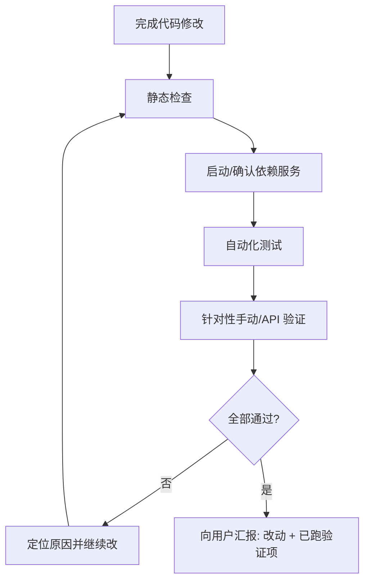

# Agent 修复与交付自测流程

本文件规定：**AI Agent 在修复问题或完成功能后，必须先自行验证，通过后再向用户汇报；未通过则继续修复，不得把未验证的改动交给用户验收。**

优先级：与 `MASTER_RULES.md` 同级，属于 `docs/rules/*` 规则文件。

---

## 1. 何时必须执行

以下任一情况**必须**走完本流程后再回复用户：

- Bug 修复、回归问题（如 Admin/API 500、页面白屏）。
- 新接口、权限、鉴权、全局中间件/过滤器变更。
- 影响 Web / Admin / API 联调的前后端改动。
- 用户明确要求「修好后自己测一遍」。

---

## 2. 标准流程（Fix → Verify → Report）



### 2.1 静态检查（必做）

在仓库根目录：

```bash
pnpm typecheck
pnpm test
```

- 任一步失败：**不得**向用户说「已修好」；先修到通过或说明阻塞原因。
- 仅改文档时可跳过 `test`，但仍需说明跳过原因。

### 2.2 依赖服务（按需）

涉及 API / DB / Redis 时，确认服务可用：

```bash
pnpm docker:up          # 如未启动
pnpm db:deploy          # 如有新迁移
pnpm db:seed            # 仅本地；生产禁止自动 seed 弱账号
pnpm db:refresh-content # 采集 RSS、标签、Insight、Feed 簇（根目录快捷命令）
pnpm db:cluster-assign  # 仅重新分配 Feed 轻聚合簇
```

API 开发：

```bash
pnpm --filter @cryptopilot/api dev
```

### 2.3 针对性验证（必做，与改动范围一致）

| 改动范围 | 最低验证 |
|----------|----------|
| API | `curl` 或集成测试：健康检查 + 本次修改的路径（含错误码） |
| Admin Web | 相关页面可打开；Network 中对应 API 为 2xx |
| Web 用户端 | 相关页面可打开；登录/需登录接口行为正确 |
| 鉴权/Guard | Guard 单测 + 带 `Authorization` / `x-user-id` 的 API 调用 |
| PWA | manifest 可访问；`sw.js` 无 404 |

**本地 Admin 快速探针（示例）：**

```bash
curl -s http://localhost:3002/api/health
curl -s -H "x-user-id: 00000000-0000-0000-0000-000000000001" \
  http://localhost:3002/api/admin/sources
curl -s -H "x-user-id: 00000000-0000-0000-0000-000000000001" \
  "http://localhost:3002/api/admin/feed"
```

**本地登录探针（示例）：**

```bash
curl -s -X POST http://localhost:3002/api/auth/login \
  -H "Content-Type: application/json" \
  -d '{"email":"admin@cryptopilot.local"}'
```

### 2.4 向用户汇报（仅通过后）

回复中须包含：

1. **改了什么**（原因 + 方案，一两句）。
2. **已执行的验证**（命令或步骤清单，以及结果）。
3. **如何复现**（用户若要再验：启动命令 + URL）。
4. **未覆盖项**（若有：为何没测、剩余风险）。

**禁止：**

- 未跑验证就说「应该可以了」「请刷新试试」。
- 把用户当作第一轮 QA。
- 隐瞒 `typecheck` / `test` 失败。

---

## 3. 常见问题对照

| 现象 | Agent 应先查 |
|------|----------------|
| Admin 页「数据加载失败」 | API 是否 2xx；`NEXT_PUBLIC_API_URL`；Admin `x-user-id` / Bearer |
| Next「client function from server」 | Server Component 是否 import 了 `"use client"` 模块 |
| API 500 + HTML 堆栈 | 全局 `ExceptionFilter` 是否注入依赖；终端原始异常 |
| 端口占用 / 旧进程 | `lsof -ti:3002` 后重启 API，确认加载的是最新代码 |

---

## 4. 与版本验收的关系

- 本流程是**每次交付/修 bug 的最低门禁**。
- 版本级验收仍以 `docs/versions/*` 第 12 节为准；通过本流程 ≠ 版本整体验收通过。
